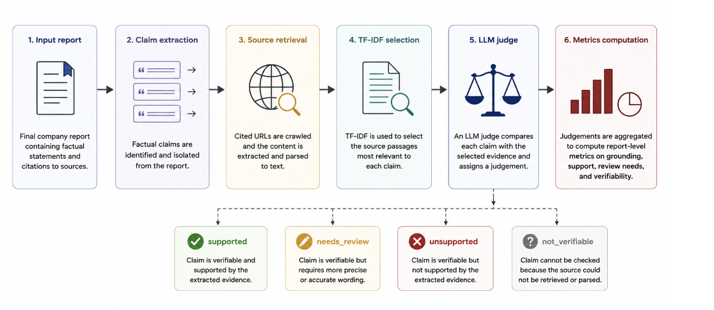

# Mapping AI Capability Building from Public Company Data

Large industrial companies rarely disclose in detail what they are building with AI. Annual reports describe strategy, but they often stay high level. Job postings are more concrete: they show which teams companies are hiring for, which skills they need, and where new capabilities may be forming.

This project turns those public signals into structured company intelligence.

I built a pipeline that analyzes 91,544 job postings from 16 global manufacturing and chemistry groups, combines them with annual reports and public sources, and produces company reports that can be searched and compared.

BSc Thesis, Bocconi University, 2026. [📄 Full thesis (PDF)](./thesis.pdf)

## What the pipeline does

The pipeline starts from raw job descriptions and extracts structured signals about:

| Signal | Why it matters |
| :-- | :-- |
| Role type | Shows whether the company is hiring for analytics, data, software, AI, automation, or research roles |
| Business area | Shows where the capability is being built, such as manufacturing, supply chain, R&D, IT, or corporate functions |
| AI relevance | Separates generic roles from roles that directly contribute to AI capability building |
| Technical tools | Captures the platforms, methods, and systems mentioned in the posting |
| Investment signal | Summarizes what the company appears to be trying to build |

These signals are grouped by company to identify patterns in hiring, geography, seniority, and business focus.

The goal is not to claim that every capability is already deployed. The goal is to understand where companies are investing, based on visible external evidence.

## From hiring signals to company reports

For each company, the pipeline produces a structured report that connects three types of evidence:

| Source | Role in the analysis |
| :-- | :-- |
| Job postings | Show hiring demand and capability building signals |
| Annual reports | Show strategic priorities and management narrative |
| Public sources | Add evidence from company pages, press releases, interviews, and investor material |

The final reports describe which AI related capabilities are visible for each company, where they appear in the organization, and how they relate to the company's public strategy.

Examples of capability areas include predictive maintenance, industrial automation, demand forecasting, materials research, supply chain analytics, and connected product services.

## Reliability check

Because generated reports can easily overstate what the sources say, I added a claim level evaluation step.

Each factual claim with a public source is checked against the cited page. The system retrieves the source, extracts relevant passages, and classifies the claim as supported, needs review, unsupported, or not verifiable.

<p align="center">
  
</p>

Across the evaluated reports:

| Metric | Result |
| :-- | --: |
| Public source claims examined | 392 |
| Claims judged | 292 |
| Supported claims | 174 |
| Needs review | 75 |
| Unsupported | 43 |
| Not verifiable | 100 |
| Grounding accuracy | 72.4% |
| Strict support rate | 59.6% |

This step makes the reports more useful as external intelligence rather than simple generated summaries.

## Searchable company intelligence

The evaluated company reports are indexed in a chatbot, so they can be queried in natural language.

Example questions:

```text
Which companies show stronger signals in predictive maintenance?

How does Michelin compare with Bridgestone in AI related hiring?

Which firms are investing in materials research capabilities?

Where is AI more visible in operations than in customer facing products?
```

## Scope and limitations

The analysis covers 16 large industrial groups selected from rubber, tyres, and automotive components, including companies such as Michelin, Bridgestone, BASF, Adient, BorgWarner, Dana, Trelleborg, and Continental.

Job postings are treated as signals of capability building, not as proof of internal deployment. Some projects may also be missing because companies do not disclose strategically sensitive work.

The repository does not include the full pipeline code because the job posting data comes from TheirStack, a proprietary data source. It documents the architecture, prompts, classification schema, evaluation method, and thesis methodology.
